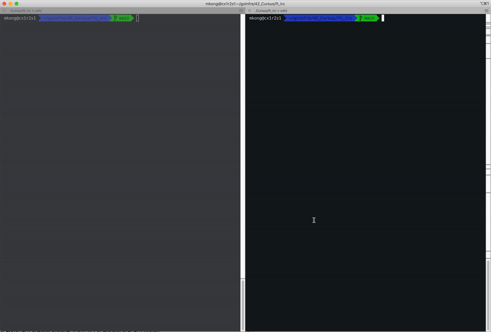

# ft_irc
42Seoul ft_irc team "IRC 혁명가들"

# 프로젝트 요구사항
- [IRC(Internet Relay Chat)](https://ko.wikipedia.org/wiki/IRC) 서버를 C++98로 구현해야 합니다.
- 결과물은 다음과 같이 실행됩니다:
    - `./ircserv <port> <password>`
    - `port`: 여러분의 서버가 들어오는 IRC 연결을 받아들일 포트 번호.
    - `password`: 연결 시에 사용되는 비밀번호. IRC 클라이언트가 여러분의 서버에 접속하기 위해 필요합니다.
- 서버는 동시에 여러 클라이언트의 요청을 처리할 수 있어야 하며, 지연되면 안 됩니다.
- 모든 동작을 처리하는 데에는 (읽기, 쓰기, 요청 듣기 등등) 단 하나의 `poll()` (또는 그와 유사한 함수) 만 사용하여야 합니다.
- 클라이언트와 서버간 커뮤니케이션은 TCP/IP (v4 또는 v6) 으로 이루어져야 합니다.
- 서버에 참조 클라이언트를 접속하면 다른 공식 IRC 서버와 비슷하게 동작하여야 합니다. 다만, 아래의 기능들만 구현하세요.
    - 인증 절차를 밟고, 닉네임과 유저명을 설정할 수 있어야 하며, 채널에 접속하고, 참조 클라이언트를 이용하여 비밀 메시지를 주고받을 수 있어야 합니다.
    - 한 클라이언트에서 채널로 보내지는 모든 메시지는 해당 채널에 접속한 모든 다른 클라이언트들에게 전송되어야 합니다.
    - 운영자와 일반 유저가 존재해야 합니다.
    - 또한, 운영자만이 사용할 수 있는 명령들을 구현하여야 합니다.
        - KICK - Eject a client from the channel
        - INVITE - Invite a client to a channel
        - TOPIC - Change or view the channel topic
        - MODE - Change the channel’s mode:
            - i: Set/remove Invite-only channel
            - t: Set/remove the restrictions of the TOPIC command to channel operators
            - k: Set/remove the channel key (password)
            - o: Give/take channel operator privilege
            - l: Set/remove the user limit to channel

# Developer
@ mkong : [서버](./server.md),클라이언트
@ jaejilee : 명령어  
@ junhylee : 채널  

# How to work
```linux
make
./ircserv <port> <password> 
```

- 좌측 터미널은 실제 irc클라이언트 중 하나인 irssi를 통해 접속하는 모습
- 우측 터미널은 동작하는 서버 모습

# Convention
## function
- lower-cammel 형식
## class
- upper-cammel 형식
- public, protected, private 순서
## variable
- snake 형식
- 멤버변수는 '_'로 시작
## Syntax
- 중괄호 {}는 개행 없이
- else if, else는 중괄호 뒤에 이어쓰기
- 조건문의 내용이 한 줄이면 중괄호 생략
## Commit Message
**"[title] description"**
- title 종류 : Mod(수정), Add(추가), Del(삭제), Fix(버그 수정)
- description: 상황에 맞게 자유롭게 직관적으로 작성


# TIG Count
- jaejilee: 1
- mkong: 0
- junhylee: 1
