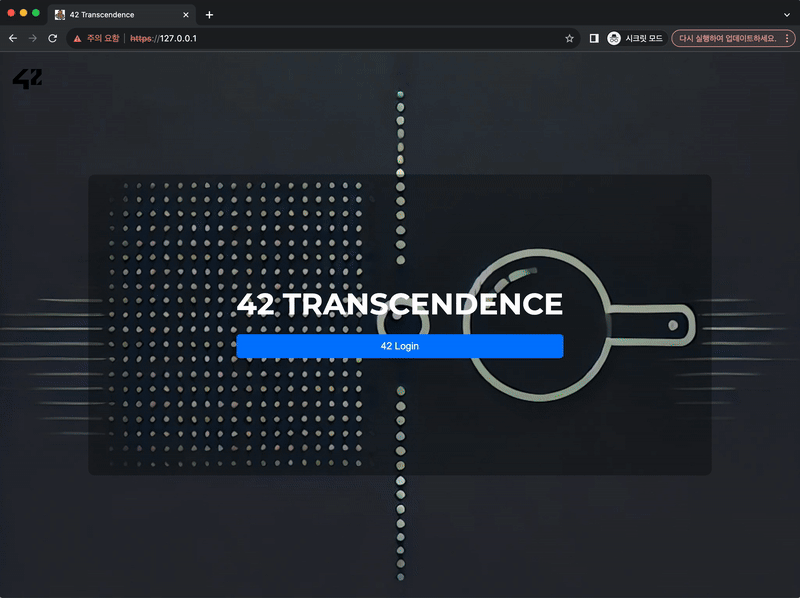
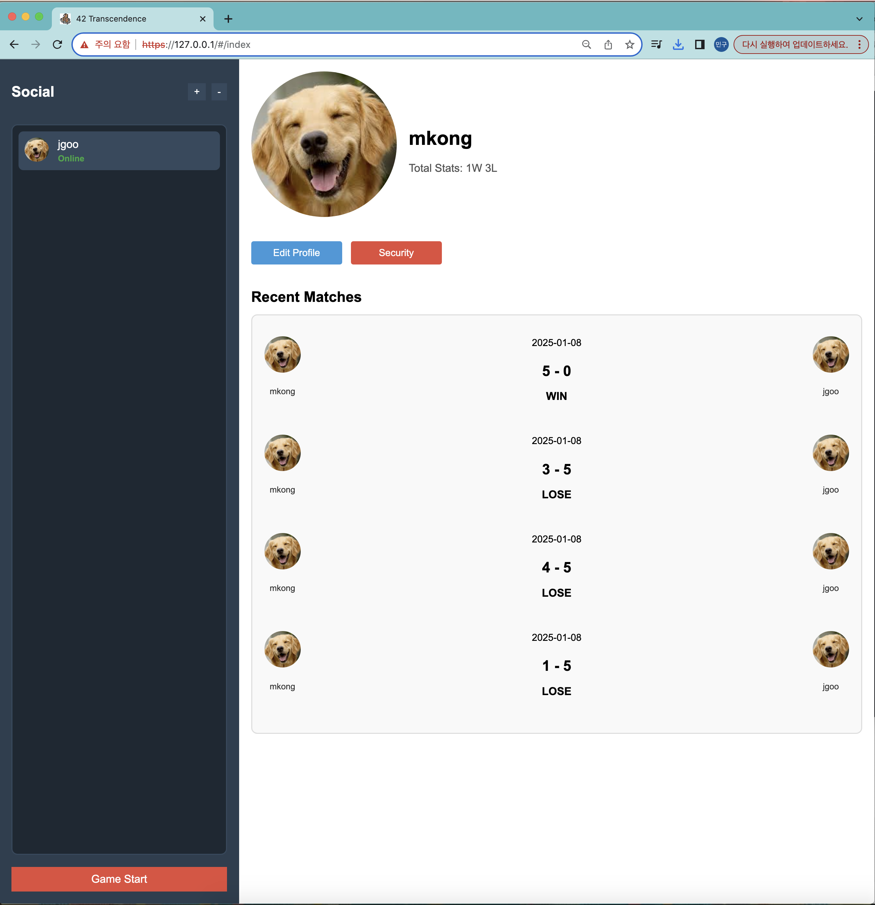

# ft_transcendence
> 실시간 멀티 플레이 핑퐁 게임이 가능한 웹 사이트 만들기


---

# 👍프로젝트 팀원
- Mkong : 백엔드
- Jgoo : 프론트 엔드
- Yakim : 백엔드, DevOps

---

# ⚙️실행방법
```bash
make #https://127.0.0.1 로 접속 가능
```

> OAuth Login



> Game


> Profile



> 

# 🚀Project Layout
- `res`
    - `requirements`
		- `django`
			- 백엔드 서버 이미지
		- `elasticsearch`, `filebeat`, `kibana`, `setup`
			- 로그 저장을 위한 elk이미지
		- `nginx`
			- 프론트 엔드 이미지
		- `postgresql`
			- 데이터베이스 이미지
