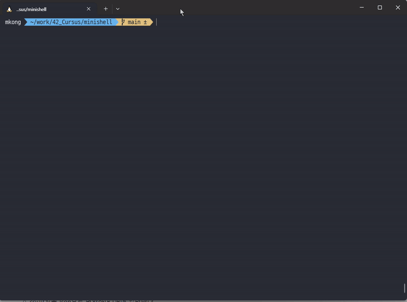

# MINISHELL🐚
- 미니쉘은 간단한 쉘을 만드는 프로젝트 입니다.
---
# ⚠️프로젝트 요구사항
- 새로운 명령어를 입력할 수 있는 프롬프트를 보여줘야 합니다.
- 작업 히스토리를 갖고 있어야 합니다.
- (PATH 변수나 상대, 절대 경로를 활영하여) 올바른 실행 파일을 찾아 실행할 수 있어야 합니다.
- 전역변수는 한개 초과를 사용할 수 없으며, 왜 전역변수를 사용했는지 깊게 생각해 보고 그 이유를 설명할 수 있어야 합니다.
    - 조심하세요! 이 전역변수는 수신된 시그널 수 이외에 어떠한 데이터 접근 또는 다른 특정 정보를 제공할 수 없습니다.
- 닫히지 않은 따옴표나 특정되지 않은 특수문자 ( \ 나 ; 등..) 를 해석하지 않아야 합니다.
- ‘ ( 단일 따옴표) 안에 있는 메타문자를 해석하지 않아야 합니다.
- “ (이중 따옴표) 안에 있는 $ ( 달러 기호 )를 제외한 메타문자를 해석하지 않아야 합니다.
- 다음의 리다이렉션을 구현해야 합니다.
    - `<` 는 입력을 리다이렉션 하여야 합니다.
    - `>`  는 출력을 리다이렉션 하여야 합니다.
    - `<<` 에는 구분 기호를 지정한 다음, 현재 소스에서 구분자를 포함한 줄을 만나기 전까지 입력값을 읽어들입니다. 기록을 업데이트할 필요는 없습니다!
    - `>>` 는 출력을 추가 모드로 리다이렉션합니다.
- 파이프( | 문자) 를 구현해야 합니다. 각 파이프 라인마다 명령어의 출력값은 파이프로 연결되어 다음 명령어의 입력값으로 들어가야 합니다.
- 환경변수 ( `$` 다음에 문자열이 오는 형식 ) 은 그들의 값으로 확장되어야 합니다.
- `$?` 는 가장 최근에 실행한 포그라운드 파이프 라인의 종료 상태를 확장하여야 합니다.
- `ctrl-C`, `ctrl-D`, `ctrl-\` 는 bash 와 동일하게 동작해야 합니다.
- 상호작용이 가능할 때 :
    - `ctrl-C` 는 새로운 줄에 새로운 프롬프트를 출력합니다.
    - `ctrl-D` 는 쉘을 종료합니다.
    - `ctrl-\` 은 아무런 동작도 하지 않습니다.
- 다음의 내장 기능( builtin )들을 실행할 수 있어야 합니다 :
    - `echo` with option `-n`
    - `cd` with only a relative or absolute path
    - `pwd` with no options
    - `export` with no options
    - `unset` with no options
    - `env` with no options or arguments
    - `exit` with no options
- 괄호를 이용해 우선순위를 표현한 `&&` , `||`
- 와일드카드 `*` 가 현재 작업 디렉토리에 대해 동작하여야 합니다.
---

# 👍프로젝트 팀원
- Mkong : 명령어 실행, 빌트인 명령어 구현
- Jgoo : 명령어 파싱, 시그널 처리

---

# ⚙️실행방법
```bash
make

./minishell
```



# 🚀프로젝트 설명
- `builtin`
    - echo, cd, pwd 등 구현이 필요한 builtin함수 코드

- `dictionary`
    - 환경변수 저장을 위한 양방향 연결 리스트 구현 및 사용을 위한 코드

- `execute`
    - 명령어 실행을 위한 코드.

- `libft`
    - Minishell에서 사용할 기본적인 함수 라이브러리.

- 그 외
    - 파싱, 와일드 카드 처리 코드.


# ✒️배운 점 및 느낀 점
- 프로젝트를 진행하기에 앞서 먼저 [bash레퍼런스](https://www.gnu.org/software/bash/manual/bash.html)를 보며 구현 방향을 잡았다.
- 가장 큰 실수 중 하나가 명령어 실행을 위해 입력된 명령어를 확장 순서에 맞춰서 처리해야 하는데, 그 순서를 혼동해 몇몇 명령어에서 정상적으로 작동이 안되는 경우가 나왔다.
    - `리다이렉션의 저장`, `쉘 확장의 수행`, `리다이렉션의 실행`, `명령어 이름의 결정과 실행`, `종료 상태`를 순차적으로 처리해야 한다.
- 이때 함수를 기능에 맞춰 단순하고 명확하게 구현해야 한다는 걸 크게 느꼈다. 이번 프로젝트에서 명령어 실행에 대한 함수를 기능에 따라 나눠서 구현해 놔 순서에 맞춰 재구현할 때 큰 수고가 들지 않았다.

---

- 42서울 프로젝트 내 첫 팀과제를 하면서 몇 가지 원칙들에 대해 생각해 봤다.
    1. 모르는 건 바로 바로 물어보기 
        - '반복된 질문이 귀찮지는 않을까?' 하는 고민때문에 처음에 특히 조심했던 것 같다. '들은 걸 토대로 내가 따로 다시 공부해 이해해야 하지 않을까' 하는 생각도 했다.
        - 이러한 방식이 프로젝트 진행을 더욱 지지부진 하게 한다는 생각이 들었다. 뿐만 아니라 반대로 내가 질문을 받을 때는 위와 같은 생각이 전혀 들지 않았던 걸 생각하면 고민할 부분이 아니었다는 생각도 들었다.
        - 프로젝트의 더 빠른 진행과 심신의 안정을 위해서라도 더욱 소통할 수 있도록 하자.
    2. 너무 자책하지 말기
        - 위와 같은 실수를 발견했을 때 레퍼런스에서 분명 봤던 부분이라는 생각이 들었다. 그 생각과 함께 자책과 함께 우울감에 매몰되었다.
        - 팀원에 대한 미안한 마음과 함께 더 긴시간 코딩을 하면서도 효율이 나오지 않는 다는 걸 느꼈다.
        - 반성은 중요하지만 그 순간에 파묻히지 않고 털어 내는 것도 중요하다는 걸 느꼈다. 
    3. 새로운 것에 겁내지 않기
        - 42서울에서 항상 느끼는 거지만 이 부분이 내가 뭘 하든 정말 중요하다는 생각이 들었다.
        - 터미널에 설치된 쉘을 사용하는 것 뿐만 아니라 직접 만든다는 생각을 해본적이 없었던 터라 처음에 정말 막막했던 기억이 있다.
        - '겁'이라는 것이 불안함, 귀찮음 같은 부정적인 감정들을 함께 낳으며 발목을 붙잡는데, 이러한 감정들이 새로운 걸 배우는데는 큰 도움이 되지 않았다.
        - 하지만 내가 하는 어떤 것이든 결국 처음에는 새로운 것이지 않았나 하는 생각이 들었다.
        - 일단 그냥 하면... 어떻게든 된다는 걸 프로젝트를 끝내고 정말 크게 느꼈다.
        - 여러 명령어들이 `minishell`에서 처리되는 걸 보며 겁내고 고민할 시간에 일단 시작을 하면 많은게 해결된다는 걸 알았다.
- 코드를 짜는 부분뿐만 아니라 외적으로도 더 깊게 생각해 볼 수 있는 시간이었다.