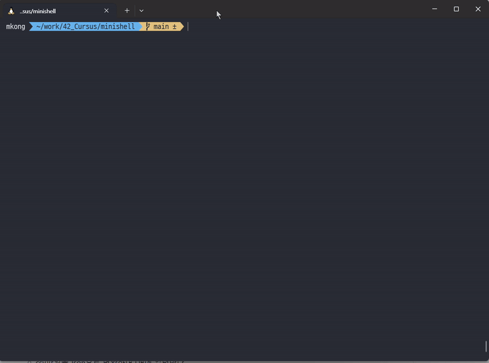

# MINISHELL🐚
- 미니쉘은 간단한 쉘을 만드는 프로젝트 입니다.
---
# ⚠️프로젝트 요구사항
- 새로운 명령어를 입력할 수 있는 프롬프트를 보여줘야 합니다.
- 작업 히스토리를 갖고 있어야 합니다.
- (PATH 변수나 상대, 절대 경로를 활영하여) 올바른 실행 파일을 찾아 실행할 수 있어야 합니다.
- 전역변수는 한개 초과를 사용할 수 없으며, 왜 전역변수를 사용했는지 깊게 생각해 보고 그 이유를 설명할 수 있어야 합니다.
    - 조심하세요! 이 전역변수는 수신된 시그널 수 이외에 어떠한 데이터 접근 또는 다른 특정 정보를 제공할 수 없습니다.
- 닫히지 않은 따옴표나 특정되지 않은 특수문자 ( \ 나 ; 등..) 를 해석하지 않아야 합니다.
- ‘ ( 단일 따옴표) 안에 있는 메타문자를 해석하지 않아야 합니다.
- “ (이중 따옴표) 안에 있는 $ ( 달러 기호 )를 제외한 메타문자를 해석하지 않아야 합니다.
- 다음의 리다이렉션을 구현해야 합니다.
    - `<` 는 입력을 리다이렉션 하여야 합니다.
    - `>`  는 출력을 리다이렉션 하여야 합니다.
    - `<<` 에는 구분 기호를 지정한 다음, 현재 소스에서 구분자를 포함한 줄을 만나기 전까지 입력값을 읽어들입니다. 기록을 업데이트할 필요는 없습니다!
    - `>>` 는 출력을 추가 모드로 리다이렉션합니다.
- 파이프( | 문자) 를 구현해야 합니다. 각 파이프 라인마다 명령어의 출력값은 파이프로 연결되어 다음 명령어의 입력값으로 들어가야 합니다.
- 환경변수 ( `$` 다음에 문자열이 오는 형식 ) 은 그들의 값으로 확장되어야 합니다.
- `$?` 는 가장 최근에 실행한 포그라운드 파이프 라인의 종료 상태를 확장하여야 합니다.
- `ctrl-C`, `ctrl-D`, `ctrl-\` 는 bash 와 동일하게 동작해야 합니다.
- 상호작용이 가능할 때 :
    - `ctrl-C` 는 새로운 줄에 새로운 프롬프트를 출력합니다.
    - `ctrl-D` 는 쉘을 종료합니다.
    - `ctrl-\` 은 아무런 동작도 하지 않습니다.
- 다음의 내장 기능( builtin )들을 실행할 수 있어야 합니다 :
    - `echo` with option `-n`
    - `cd` with only a relative or absolute path
    - `pwd` with no options
    - `export` with no options
    - `unset` with no options
    - `env` with no options or arguments
    - `exit` with no options
- 괄호를 이용해 우선순위를 표현한 `&&` , `||`
- 와일드카드 `*` 가 현재 작업 디렉토리에 대해 동작하여야 합니다.
---

# 👍프로젝트 팀원
- Mkong : 명령어 실행, 빌트인 명령어 구현
- Jgoo : 명령어 파싱, 시그널 처리

---

# ⚙️실행방법
```bash
make

./minishell
```



# 🚀Project Layout
- `builtin`
    - echo, cd, pwd 등 구현이 필요한 builtin함수 코드

- `dictionary`
    - 환경변수 저장을 위한 양방향 연결 리스트 구현 및 사용을 위한 코드

- `execute`
    - 명령어 실행을 위한 코드.

- `libft`
    - Minishell에서 사용할 기본적인 함수 라이브러리.

- 그 외 `home`에 있는 파일들
    - 파싱, 와일드 카드 처리 코드.
